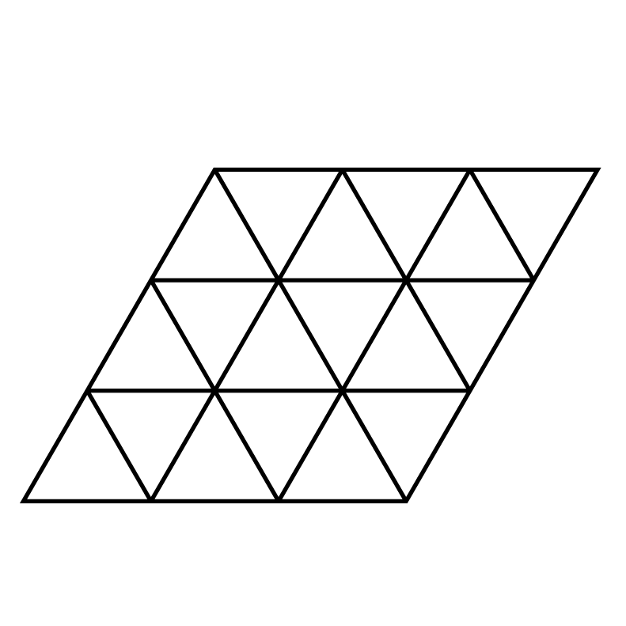
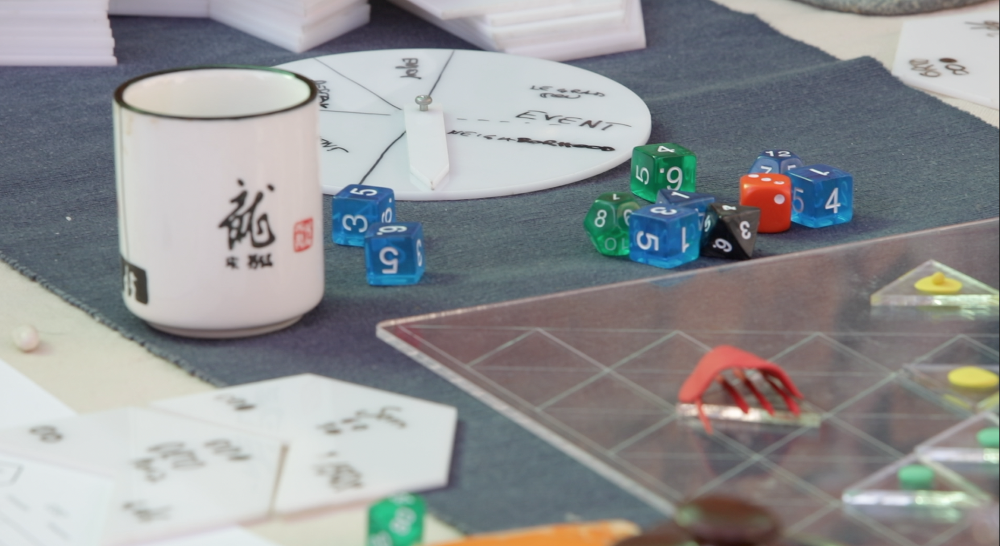

###### 

# legrandjeu

Is a open table game.
It is presented as a forkable set of rules for infinite games of this type.
Implements concepts from partecipatory democracy, free culture, complementary currencies, role playing game, sutainable energy and permaculture design.

the game is a concept and an idea by Federico Bonelli (c)2016
* lead design is by Federico Bonelli and Raffaella Rovida

you can follow us from the website www.legrandjeu.net

- Lead: Federico Bonelli (Trasformatorio Stichting www.trasformatorio.net)
- Co-designed: Raffaella Ravida (Ciid.dk) and Federico Bonelli

## Presenti alle sessioni di design MACAO (9-14 Luglio 2016) ITER 1-6 e giocatori attivi:
Federico Bonelli, Raffaella Rovida, Maddalena Fragnito, Marco Sachy, Emanuele Braga, Camilla Pin, Andrea Masu, Costantino Buongiorno, Zoe Romano, Diego Weisz, Manuela Casiraghi

## Venice Sessions April-May 2017
Raffaella Rovida (CIID) and Federico Bonelli

- iteration 8 of the design, made and cut by Raffaella
- played different scenarios with Venice as an ambientation
- Many thanks to SALE DOKS and [Assemblea Sociale per la Casa Venezia](https://www.facebook.com/search/top/?q=casettegiudecca)
- see again www.legrandjeu.net

## 

## Taiwan 2018

- Intelligent Urban Fabric, Conference Taipei, 17/18 November 2018

## China 2018
- Intelligent Urban Fabric, Third Annual conference of the Network Society, Huangzou, 20/23 November 2018

## EUROFusion edition 2019/2022
- Marseille 2021 Thanks to Mohamed Belhorma, DTU, MaxPlank Institute
- thanks but no thanks to COVID19 pandemics

© 2016-2022 Federico Bonelli & Raffaella Rovida - Trasformatorio Foundation Amsterdam

This work is licensed under a <a rel="license" href="http://creativecommons.org/licenses/by-nc-sa/4.0/">Creative Commons Attribution-NonCommercial-ShareAlike 4.0 International License</a>.
