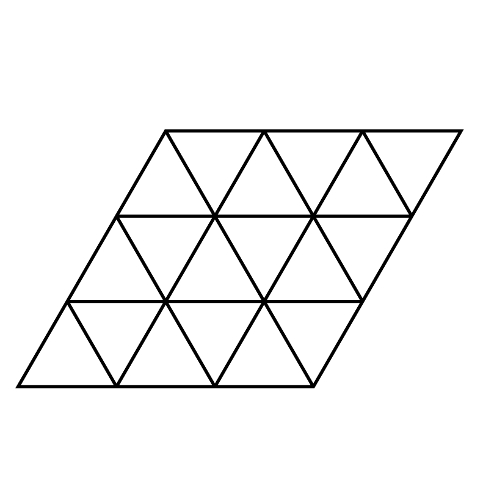

# legrandjeu

Is a open table game.
It is presented as a forkable set of rules for infinite games of this type.
Implements concepts from participatory democracy, free culture, complementary currencies, role playing game, sutainable energy and permaculture design.

the game is a concept and an idea by Federico Bonelli in 2016
* lead design is by Federico Bonelli and Raffaella Rovida

you can follow us from our website www.legrandjeu.net

- Lead: Federico Bonelli (Trasformatorio Stichting www.trasformatorio.net)
- Co-designed: Raffaella Ravida and Federico Bonelli (extra credits and thanks on the website and for each co-design sprint)

Le Grand Jeu might refer as well to:
- The Great Game (in French Le Grand Jeu), the strategic rivalry between the British Empire and the Russian Empire for supremacy in central Asia. See for example the book of Peter Hopkirk "the Great Game" (1990)
- Le Grand Jeu, the title of a French literary review, founded in 1928 by René Daumal and others, surrealist in intent and experimentalist in practice
- Le Grand Jeu, a 1928 poetry collection by Benjamin Péret from the same circle
- The Glass Bead Game, a book by Herman Hesse printed in 1943. The game described in this book shares nothing with LGJ rules but spiritual echoes.

### SPES Edition 2025

Customisation for EU Project SPES (work in progress). First iteration Florence 23 september 2024

### GSR Edition 2024
The Green Silk Road https://www.thegreensilkroad.com/about  
Radical concepts about sustainable slow travel, collaboration, arts, and regeneration while doing the walk of an alternative way of living.  
GSR variant of LGJ developing in collaboration and co-design includes dreamwaving logistics, movement, and culture scapes.

### EUROFusion edition 2019/2022
- Marseille 2021 Thanks to Mohamed Belhorma, DTU, Max Planck Institute  
- Thanks but no thanks to COVID-19 pandemics

### China 2018
- Intelligent Urban Fabric, Third Annual Conference of the Network Society, Huangzou, 20/23 November 2018

### Taiwan 2018
- Intelligent Urban Fabric, Conference Taipei, 17/18 November 2018

### Venice Sessions April-May 2017
Raffaella Rovida (CIID) and Federico Bonelli  
- Iteration 8 of the design, made and cut by Raffaella  
- Played different scenarios with Venice as an ambientation  
- Many thanks to SALE DOKS and [Assemblea Sociale per la Casa Venezia](https://www.facebook.com/search/top/?q=casettegiudecca)  
- See again www.legrandjeu.net

### Design Sessions in MACAO MILAN (9-14 Luglio 2016) Iterations 1-6 and Active Players:
Federico Bonelli, Raffaella Rovida, Maddalena Fragnito, Marco Sachy, Emanuele Braga, Camilla Pin, Andrea Masu, Costantino Buongiorno, Zoe Romano, Diego Weisz, Manuela Casiraghi

© 2016-2024 Federico Bonelli & Raffaella Rovida - Trasformatorio Foundation Amsterdam

This work is licensed under a <a rel="license" href="http://creativecommons.org/licenses/by-nc-sa/4.0/">Creative Commons Attribution-NonCommercial-ShareAlike 4.0 International License</a>.
