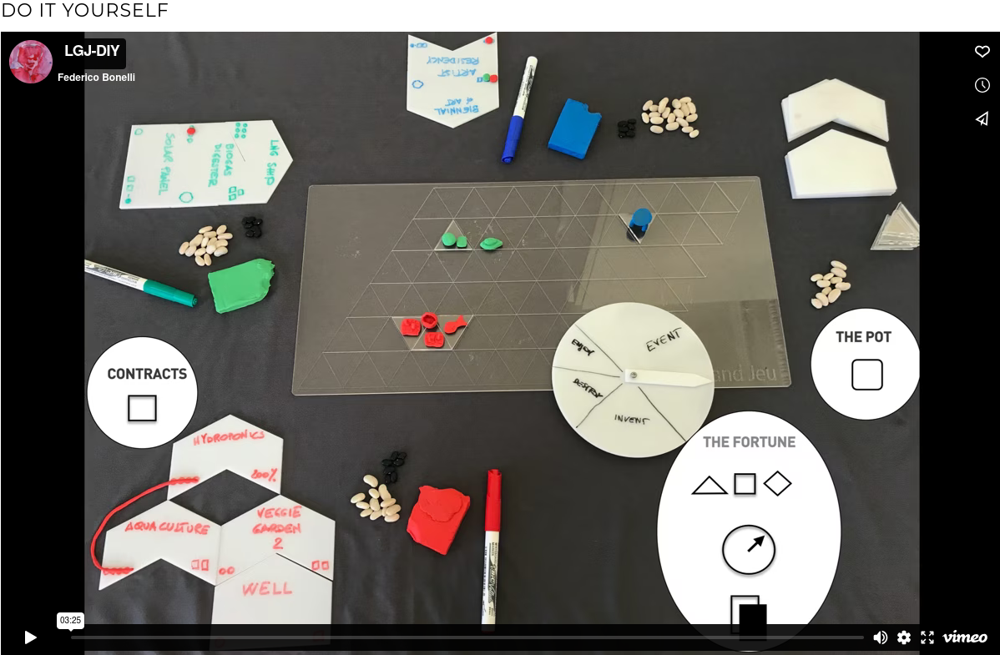

# ¨le Grand Jeu¨

A working example of situation oriented analysis for sustainable micro-economies exposed through play

A table game allows to set a situation where concepts emerge from doing, players are by default considered as peers. We can simulate different conditions and behaviour emerge and get immediate feedback from the game environment. In a game all languages intermix, specialist terminology has to be translate, and stories emerge.

## Le Grand Jeu (SPES edition)

¨Le Grand Jeu" is the name of a game designed in May-July 2016 by Federico Bonelli and Raffaella Rovida, and that finalised in a 4 days workshop held in Milan 10-14 July 2016 and perfectioned in another 2 iterations in Venice and presented last 11 of May in SALE Doks for Darkmattergames, a side event of Biennale 2017.

The SPES scenario has been developed and carefully design for the SPES project.

> An interesting historical precedent to this approach is included in the genesis of the world famous counterpart of Le Grand Jeu, MONOPOLI.
> Monopoli, that teaches traditional forms of capitalism to children since the ´30es had been originally developed to demonstrate the feasibility of socialist and progressive doctrines of Toureau. Developed and patented by a woman, Elisabeth Phillips, in 1903, was plagiarized and sent to Parker Brothers that exploited it. Is apparently the man that plagiarized it that substituted "mother nature" with "the bank".

## How to play



https://vimeo.com/477278036

in the video above there is a fast presentation of the elements of the game and their use. All pieces are to be found in printable or laser-cut formats on our github page.

> Tag us on Twitter: @legrandjeu11 #LGJ 

If you want to build something on LGJ get in touch. It will always be free to take and play for communities and you people out there.

[^1]: Le Grand Jeu is open source and free to use for **non commercial applications.** It is released under [creative commons licence](https://creativecommons.org/licenses/by-nc/4.0/). 

The community of players is expanding and we would love to hear about your experience with it. Twitter is made for this and we will be happy  to give visibility to your games and looking forward to your feedback.

Add yourself to the [Telegram master channel](https://t.me/joinchat/AKuxw1jJr3xdYMGw9IKc8A) to have a chat with the authors and other people using the game.

## The Game comes with a set of DIY components:

- **The Board**: The playing surface consists of a diamond shaped grid of triangular boxes, which we will call the network.
- **Triangular shapes** that fit every area on the network are named "Territories".
  If you put your area outside of the network you say that that territory is off the grid. Adjacent territories can transport matter without extra expenses.
- **Currency**: Grays and Whites are the two the currency of the game translating wide concepts like white: money, cryptocurrency, resources, knowledge, etc.; black: pollution, loss of biodiversity, bad karma, depletion of resources, raise of entropy, etc. Energy accounting into money transactions allows to correctly model circular economy subjects.
- **Dices**: A (set of): to rule probability, basically most things can be modeled with combinations of d6 but we like to suggest D&D dices. Notation: 1d6 means "throw one dice of 6", 2d8 "throw two dice of 8" etc.
- The **Wheel of Fortune**: simulates an event that has, a priori, a clear distribution law of probability. Includes two types of events, the action of invent, enjoy and destroy. For particular purposes the distributions can be varied at the beginning of the game by the master
- The **local economy** is visible to everyone as it unfolds on the table. The public money in the game are left in the plate of the master. Is the plate were both black and white coins stay after they are "generated" by players activity. On this plate can operate the assembly, redistributing resources or deciding taxation schemes.
- The **Functional Elements** and the Line: Elements of Line of process organized for now in 4 lines: agriculture, animals, energy and logistics; and on 3 levels: procurement, production, 2.0. To each element is associated a production cost, a management cost and a yield. Element can be combined in lines of production, individually or cooperatively or under any other form of agreement. The master can extend this side in his presentation of the game whenever the game is organized to set a situation.
- **Learn**: is possible for any player to “learn” something. The process and its cost are modelled case by case from the master
- **Enjoy**: starts an activity that might cost but burns gray
- **Lands and Tokens**: free representation and production of the Lands owned by players and of the Functional Elements acquired or exchanged to be placed on the Board. The gamers are also provided with building material  (pongo or sticks and colored papers), and encouraged to build upon their territories what they have constructed as a line of process
- Means of **transport**, logistics etc.
  They can be simulated in the game and described as production lines. A physical representation will be made by the player to be put on the board and move if is the case.
- **Master diary**: to inspire and support the reporting of the Master including a Note-taking form, a matrix of Elements, a list of Events and a list of Victory rule for the table and for the tournament.
- **Cards** they are divided in two groups, cards that pertain to global events within chain of events that live outside of the players reach (like the hitting of a meteorite), which are called “le grand jeu events”. The second group of events are events connected to the general playing field, and are just “events” or “luck”. Their function is to help the master to model the situation and also to move on the game creating turbulence and friction.

### Set of basic rules:

- Set-up: 
  roll of dice to distribute lands, blacks and whites to the players. Is up to the master to decide how much land and resources our players have access to at the beginnig of the game. 
  Es. 1d6 of Territories, 3d6 of white, 1d6 of black each.

- Round: 
  - each player pays 1 white in the Common pot; this is the "expenses/taxes";
  - then “Invests” or “Learns” or “Calls the Assembly”;
  - at the end of each round one of the players in turn spins the Wheel of Fortune

Strategy

- fee for player’s death double the gray for all players.
- carrying capacity: if amount of gray exceeds the total of 50 game is lost

## TO WIN

According to the rule adopted to win we will develop the game in a direction or another. 
The rule is stated as soon as one player asks for it according and reflects on the situation that we want to model.

 For example the more used rule of win is:
a) wins the player that after n tours (or for ex. 2 hrs game time) has the best balance between white and grays
another can be
b) wins who has more white, no matter the gray
c) in case of multiple tables wins the table that has less black

---

The Game is facilitated by a Master that plays the wheel of Fortune, rules the creation of new Elements and laws, and report the strategies and dynamics arisen on the Diary. The Master should have a basic knowledge of physics, economy and enough creativity to nurture a plausible and fun game playing neutrally.

All rules can be changed by consensus of the assembly of the players, loca laws and rules, the use of tax collected money, assessment on forms of governance etc. As well the rules of "the Game".

D and role playing games, but he is not a dictator, more a facilitating coordinator and shifter of knowledge that keeps track of the story emerging from within the act of playing.

Every game set has a master book were each game the master can annotate extra rules, things he modeled for the players and changes to the basic rules. Is the memory of the game set and consist in a representation of the forking of any free open source project.

We have produced an extensive master book for the SPES scenatio.

**Some key (and rather esoteric) concepts for playing as the master:**

You are the chaos master, neutral as nature
0\. You keep notes

 1. You shift information
 2. You carve the situation and move it to the flow
 3. You act upon space/time with perception altering techniques
 4. You hide or reveal elements at will
 5. You give and take out weight to elements
 6. You act with true intentions
 7. You take blame and responsibility
 8. You can be you
 9. To decide you throw the dices
10. If you have no idea probability is by default to 50% or 1/(number of options)
11. number of options is a bet, knowledge is always incomplete

**Some notes about what is a Situation**

1. The situation is the game field
2. Situations can not be meaningful if isolated
3. Morphic field hypothesis: connections between agents in situation and different situations is mobile and full of tunnels.
4. A situation is always in a place. The place is therefore an actor in the process
5. A situation has a duration
6. A situation has actors. No pure observer exist; a situation that is spied upon is a different situation from one that is not spied upon, no matter if those in the situation know or not about their observers.
7. A useful situation is temporary
8. A situation is useful to our aims when there is a third force that determines its end: for example a performance or a final presentation or a review

**Some concepts attached to the process of transformation**

  1. Transformation is the element that describes the welcomed rise of complexity in a creative process
  2. In transformation self organization is a good practice
  3. Transformation is possible only in very strictly ruled systems that allow open situations
  4. A reorganization, ghestalt re-orientation or simplification maneuver that breaks symmetry of the problem is a welcome gift from the world
  5. Quality is not Perfection
  6. Self similarity is a product of feedback
  7. Feedback is always present
  8. Stories is what you want to emerge, let stories live on, observe
  9. Shared, autonomous selections of stories creates narrative
 10. Lie: a good story is sometimes worth a change of perspective
 11. A transformator is the working implementation of a transformation into a situation that is at the same time aware of itself. This concept comes from media art and is implemented in the game.
 12. Remember that "minimalism is baroque of the lazy people". You dry what is wet, wet what is dry, process is king

MOST OF ALL HAVE FUN AND RECREATE YOURSELVES


```md
#### Creative Commons License Le Grand Jeu is licensed under a [Creative Commons Attribution-NonCommercial 4.0 International License.](https://creativecommons.org/licenses/by-nc/4.0/) 

You are free to:
**Share** — copy and redistribute the material in any medium or format
**Adapt** — remix, transform, and build upon the material

The licensor cannot revoke these freedoms as long as you follow the license terms.

**Under the following terms:**
**Attribution** — You must give appropriate credit, provide a link to the license, and  indicate if changes were made. You may do so in any reasonable manner,  but not in any way that suggests the licensor endorses you or your use.

**NonCommercial** — You may not use the material for commercial purposes.

**No additional restrictions** — You may not apply legal terms or technological measures that legally restrict others from doing anything the license permits.
```

